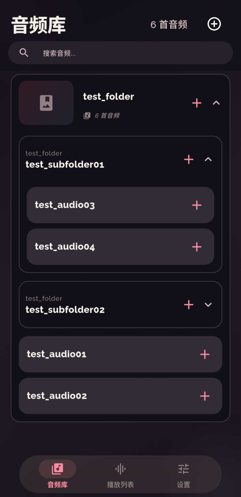
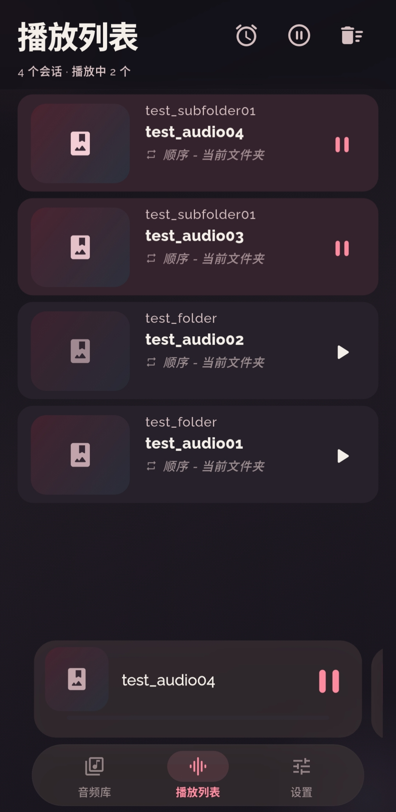
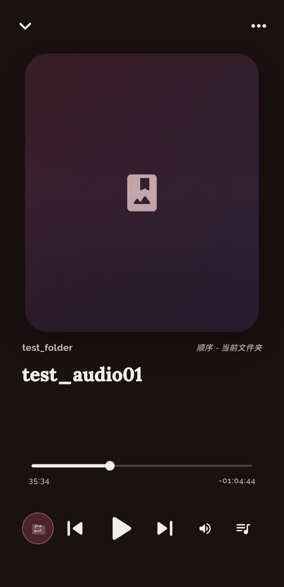
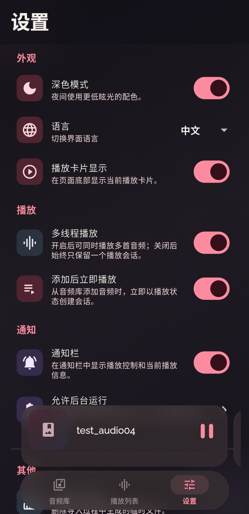
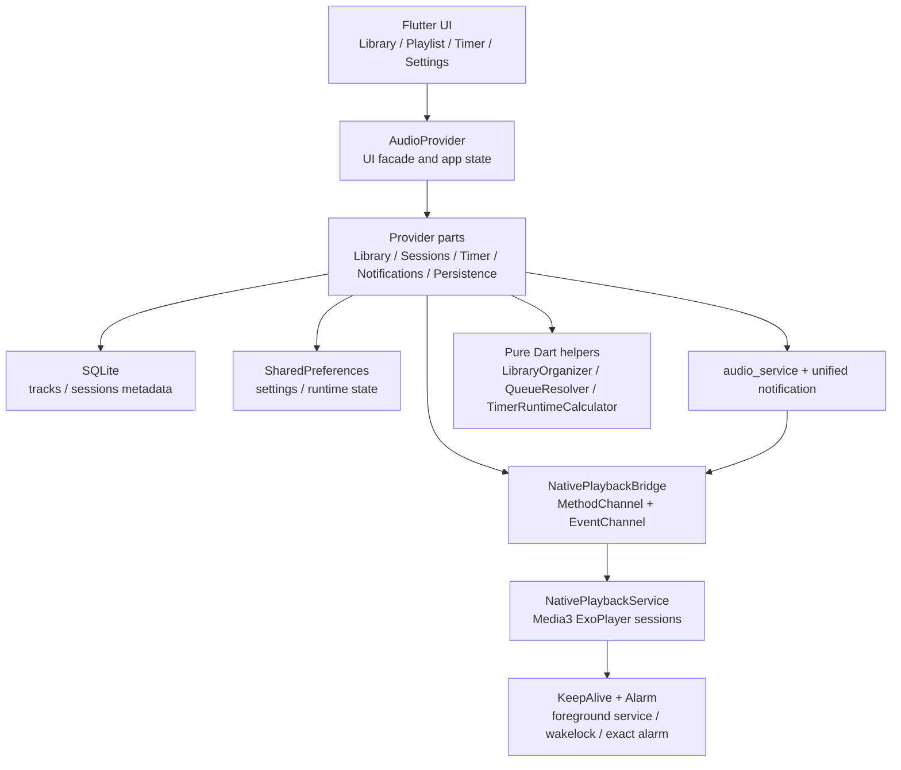

# AudioPlayer

AudioPlayer 是一款面向 Android 本地音频库、ASMR、长音频和多会话播放场景的 Flutter 音频播放器。应用用 Flutter 承载界面和业务状态，用 Android 原生 Media3/ExoPlayer 承载后台播放、息屏保活、通知控制和定时器兜底。

当前版本：`1.1.12+10112`

最新发布页：[v1.1.12](https://github.com/NameIess-art/AudioPlayer/releases/tag/v1.1.12)

## 截图

| 音频库 | 播放列表 |
|---|---|
|  |  |

| 会话详情 | 设置 |
|---|---|
|  |  |

## 功能亮点

- 多会话播放：可同时创建多个播放会话，每个会话独立控制播放、暂停、切歌、进度、音量、循环策略和左右声道交换。
- 后台与息屏稳定播放：Android 原生播放服务、前台服务、唤醒锁和原生定时闹钟共同兜底，降低长时间息屏后被系统中断的概率。
- 睡眠计时器：支持手动倒计时、播放触发倒计时、到时暂停，以及计时结束后的定时自动恢复播放。
- 统一通知控制：支持单会话/多会话通知、播放暂停、上一首、下一首、恢复通知、关闭通知和分组摘要。
- 曲库管理：支持文件夹/资料库导入、原生扫描、去重、目录树排序、搜索、封面发现和持久化。
- 元数据持久化：SQLite 保存曲库、播放会话、扫描时间、文件大小、mtime、播放进度、收藏、标签、封面缓存和歌词路径等扩展字段。
- 字幕与封面：支持字幕解析缓存、播放进度字幕刷新、通知字幕、文件夹封面发现和封面失败缓存。
- 视频转音频：通过 FFmpeg Kit 提取音轨，支持 MP3、FLAC、WAV、AAC、OGG。
- 多语言与主题：支持简体中文、日语、英语，以及 Material 3 风格的深浅色主题。

## 下载

从 [GitHub Release v1.1.12](https://github.com/NameIess-art/AudioPlayer/releases/tag/v1.1.12) 下载适合设备 CPU 架构的 APK：

| 文件 | 适用设备 |
|---|---|
| `app-arm64-v8a-release.apk` | 大多数 2018 年后的 Android 手机，推荐优先下载 |
| `app-armeabi-v7a-release.apk` | 较老的 32 位 Android 设备 |
| `app-x86_64-release.apk` | x86_64 模拟器或少量 x86 Android 设备 |

如果不确定设备架构，优先尝试 `app-arm64-v8a-release.apk`。安装时 Android 可能提示“未知来源应用”，需要允许浏览器或文件管理器安装 APK。

## 架构概览



## 项目结构

```text
lib/
  i18n/                         多语言文案
  models/                       MusicTrack、LibraryNode、PlaybackMode
  providers/                    AudioProvider 门面与功能拆分
  screens/                      音频库、播放列表、计时器、设置、视频转换
  services/                     SQLite、Native 桥接、通知、字幕、队列、更新
  theme/                        Material 3 主题
  widgets/                      通用组件

android/app/src/main/kotlin/    原生播放、通知、扫描、计时器闹钟、保活服务
docs/Screenshot/                README 和 Release 使用的应用截图
third_party/audio_service/      项目内维护的 audio_service fork
test/                           数据库、队列、通知、计时器、Provider 等测试
```

## 权限说明

| 权限 | 用途 |
|---|---|
| `READ_MEDIA_AUDIO` / `READ_EXTERNAL_STORAGE` | 扫描和播放用户选择的本地音频 |
| `MANAGE_EXTERNAL_STORAGE` | 支持完整本地音频库扫描，可改用系统文件选择器导入 |
| `POST_NOTIFICATIONS` | Android 13+ 显示播放通知 |
| `FOREGROUND_SERVICE` / `FOREGROUND_SERVICE_MEDIA_PLAYBACK` | 后台与息屏播放 |
| `WAKE_LOCK` | 降低息屏后 CPU 过早休眠导致播放/计时不稳定的概率 |
| `REQUEST_IGNORE_BATTERY_OPTIMIZATIONS` | 引导用户允许后台运行/忽略电池优化 |
| `SCHEDULE_EXACT_ALARM` | 计时器到点暂停和自动恢复播放的原生兜底 |
| `REQUEST_INSTALL_PACKAGES` | 应用内下载新版 APK 后触发系统安装流程 |
| `INTERNET` | 检查 GitHub Release 更新 |

## 本地开发

```bash
flutter pub get
flutter analyze
flutter test
flutter run
```

构建三个 ABI 发布包：

```bash
flutter build apk --release --split-per-abi
```

## 测试覆盖

- SQLite 曲库和会话持久化、旧 JSON 迁移、元数据字段读写。
- 播放队列策略：单曲循环、文件夹顺序/随机、跨文件夹顺序/随机。
- 多会话播放状态隔离、乐观播放状态去重、Native 快照同步。
- 通知控制：媒体按钮、自定义会话动作、上一首/下一首、分组摘要、通知删除。
- 睡眠计时器：等待播放触发、倒计时、过期、暂停后自动恢复。
- 字幕缓存、视频转音频命令生成和输出文件冲突处理。

## 发行说明 v1.1.12

- 优化后台播放和息屏播放链路，原生服务会保存可恢复的播放会话状态。
- 补强睡眠计时器，原生 Alarm 可在 Flutter 计时器不活跃时触发暂停和自动恢复。
- 拆分 `AudioProvider` 的状态、Native 桥接、曲库、播放会话、通知、字幕、封面、计时器和持久化职责。
- 强化 SQLite 元数据设计，为扫描时间、文件大小、mtime、播放进度、收藏、标签、封面缓存和歌词路径预留完整字段。
- 修复底部播放卡片播放/暂停按钮的点击圆圈与图标对齐问题。
- 更新 README、版本信息和截图资源，发布 arm64-v8a、armeabi-v7a、x86_64 三个 APK。
