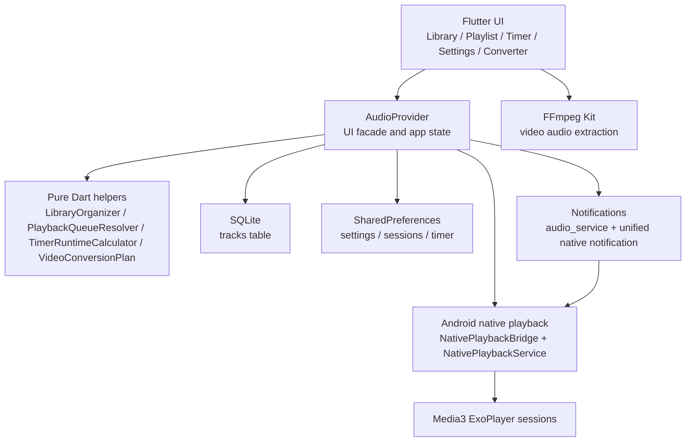

# AudioPlayer

AudioPlayer 是一个基于 Flutter 的 Android 本地音频播放器，面向同人音声、ASMR、长音频和本地资料库场景。它支持多会话并行播放、原生前台播放服务、统一通知栏控制、SQLite 曲库持久化、睡眠计时器、字幕显示和视频转音频。

当前版本：`1.1.10+10110`

最新发布页：[v1.1.10](https://github.com/NameIess-art/AudioPlayer/releases/tag/v1.1.10)

## 功能亮点

- 多会话播放：多个音频会话可并行播放，每个会话独立控制播放、暂停、切歌、进度和音量。
- 后台与息屏播放：Android 原生播放服务负责真实播放链路，Flutter 负责 UI 和状态协调。
- 通知栏控制：统一通知和会话动作支持播放、暂停、上一首、下一首、恢复通知和关闭通知。
- 音频库管理：递归扫描本地文件夹，按目录组织音频，支持搜索、排序、去重和封面发现。
- SQLite 持久化：曲库数据从 SharedPreferences JSON 迁移到 SQLite，降低大曲库加载和写入压力。
- 播放策略：支持单曲循环、文件夹顺序、跨文件夹顺序、文件夹随机和跨文件夹随机。
- 睡眠计时器：支持手动倒计时、播放触发倒计时、到时暂停和自动恢复状态计算。
- 视频转音频：通过 ffmpeg 提取视频音轨，支持 MP3、FLAC、WAV、AAC、OGG。
- 字幕与封面：支持字幕解析缓存、通知字幕刷新、文件夹封面递归发现和失败缓存。
- 多语言与主题：支持简体中文、日语、English，以及 Material 3 深色/浅色主题。

## 下载安装包

从 [GitHub Release v1.1.10](https://github.com/NameIess-art/AudioPlayer/releases/tag/v1.1.10) 下载适合设备 CPU 架构的 APK：

| 文件 | 适用设备 |
|---|---|
| `app-arm64-v8a-release.apk` | 大多数 2018 年后的 Android 手机，推荐优先下载 |
| `app-armeabi-v7a-release.apk` | 较老的 32 位 Android 设备 |
| `app-x86_64-release.apk` | x86_64 模拟器或少量 x86 Android 设备 |

如果不确定设备架构，优先尝试 `arm64-v8a`。安装时 Android 可能提示“未知来源应用”，需要允许浏览器或文件管理器安装 APK。

## 架构图



## 技术栈

- Flutter `3.41.x` / Dart `3.11.x`
- `just_audio`：Flutter 侧音频状态模型兼容
- `audio_service`：通知栏和媒体会话集成，本项目维护了 `third_party/audio_service`
- Android Media3 ExoPlayer：原生后台播放和多会话播放核心
- `provider`：应用状态管理
- `sqflite`：曲库 SQLite 持久化
- `shared_preferences`：设置、会话和计时器轻量状态
- `ffmpeg_kit_flutter_new_audio`：视频音轨提取

## 项目结构

```text
lib/
  i18n/                         # zh / ja / en 文案
  models/                       # MusicTrack 等数据模型
  providers/                    # AudioProvider 门面和播放/通知/持久化扩展
  screens/                      # 音频库、播放列表、计时器、设置、视频转换
  services/                     # 数据库、通知、播放队列、字幕、视频转换 helper
  theme/                        # 主题缓存与切换
  widgets/                      # 通用组件

android/
  app/src/main/kotlin/          # MainActivity、NativePlaybackService、通知接收器

third_party/
  audio_service/                # 定制版 audio_service

test/
  *_test.dart                   # 播放、多会话、通知、数据库、视频转换、计时器等测试
```

## 权限说明

| 权限 | 用途 |
|---|---|
| `READ_MEDIA_AUDIO` / `READ_EXTERNAL_STORAGE` | 扫描和播放用户选择的本地音频文件 |
| `MANAGE_EXTERNAL_STORAGE` | 在部分 Android 版本上支持完整本地音频库扫描，用户可拒绝后改用文件选择器导入 |
| `POST_NOTIFICATIONS` | Android 13+ 显示播放通知和会话控制 |
| `FOREGROUND_SERVICE` / `FOREGROUND_SERVICE_MEDIA_PLAYBACK` | 后台和息屏播放时保持播放服务 |
| `WAKE_LOCK` | 降低息屏播放被系统过早挂起的概率 |
| `REQUEST_IGNORE_BATTERY_OPTIMIZATIONS` | 引导用户将应用加入电池优化白名单，改善长时间播放稳定性 |
| `REQUEST_INSTALL_PACKAGES` | 应用内下载新版 APK 后触发系统安装流程 |
| `INTERNET` | 检查 GitHub Release 更新 |

## 本地开发

```bash
flutter pub get
flutter analyze
flutter test
flutter run
```

构建三个发布 APK：

```bash
flutter build apk --release --split-per-abi
```

构建 arm64 单包：

```bash
flutter build apk --release --target-platform android-arm64
```

## 测试覆盖

当前测试重点覆盖：

- 播放队列：单曲循环、文件夹顺序、跨文件夹顺序、随机播放、边界路径。
- 多会话：原生播放快照只更新匹配会话，乐观播放状态不重复广播。
- 通知栏：媒体按钮、会话自定义动作、通知清空、上一首/下一首控制和分组摘要。
- 数据库：SQLite 曲库 CRUD、重复写入替换、删除、旧 JSON 迁移。
- 视频转换：时长解析、ffmpeg 命令生成、输出文件名冲突避让。
- 计时器：倒计时、等待播放触发、过期暂停和自动恢复状态计算。

## 常见问题

### 息屏后播放停止怎么办？

先确认通知权限已开启，并在系统设置中允许后台运行或忽略电池优化。不同厂商系统会主动限制长时间后台任务，允许前台播放服务和电池白名单能显著提升稳定性。

### 为什么关闭通知后还有播放状态？

应用会区分用户主动关闭通知和系统恢复媒体会话。本版本优化了通知同步和恢复逻辑，若需要重新显示通知，可在应用内恢复播放通知或重新播放任一会话。

### 为什么需要管理所有文件权限？

本地音频库扫描需要遍历用户选择的文件夹。若不授予完整存储权限，也可以通过系统文件选择器导入文件或目录，但自动扫描能力会受限。

### 视频转换失败怎么办？

确认源文件可读、输出目录可写，并尝试换成 MP3 或 WAV。部分视频编码或容器可能无法被设备上的 ffmpeg 运行时正确解析。

### 应该下载哪个 APK？

大多数手机选择 `app-arm64-v8a-release.apk`。老设备可尝试 `app-armeabi-v7a-release.apk`，模拟器通常使用 `app-x86_64-release.apk`。

## Release 说明

`v1.1.10` 重点强化了后台播放、通知同步、运行时流畅度和核心逻辑测试覆盖，并统一了 README、`pubspec.yaml` 和 Release 版本号。
