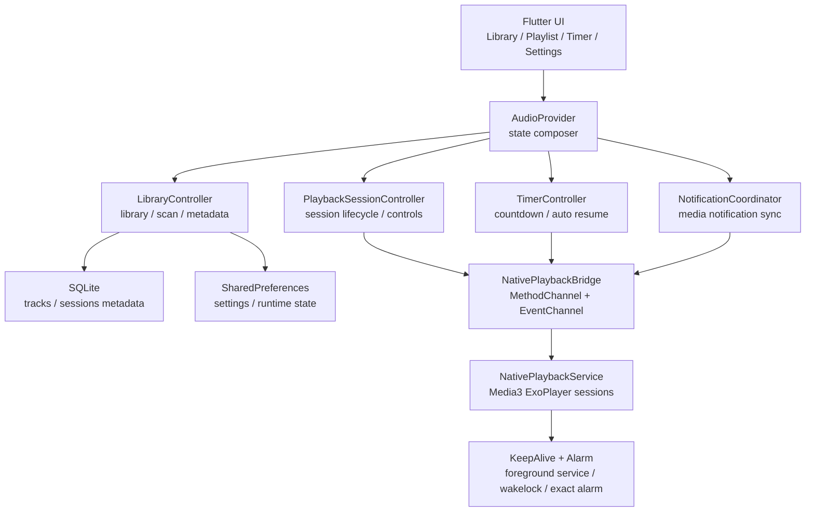

# Nameless Audio

Nameless Audio 是一款面向 Android 本地音频库、ASMR、长音频和多会话播放场景的 Flutter 音频播放器。界面和业务状态由 Flutter 承载，后台播放、通知控制、息屏保活、原生计时闹钟和文件扫描由 Android 原生能力兜底。

当前版本：`0.8.0+800`

最新发布页：[v0.8.0](https://github.com/NameIess-art/nameless-audio/releases/tag/v0.8.0)

许可证：[MIT](https://github.com/NameIess-art/nameless-audio/blob/main/LICENSE) | [隐私说明](https://github.com/NameIess-art/nameless-audio/blob/main/PRIVACY.md) | [权限说明](#权限说明)

> **注意**：自 v0.8.0 起，Android `applicationId` 已从 `com.example.music_player` 变更为 `com.nameless.audio`。此变更会导致新版本无法覆盖安装旧版本（两者被视为不同应用）。升级前请卸载旧版本，或导出数据后全新安装。旧版本用户如需迁移数据，请保留 `audio_player.db` 数据库文件。

## 功能亮点

- 多会话播放：可同时创建多个播放会话，每个会话独立控制播放、暂停、切歌、进度、音量、循环策略和左右声道交换。
- 后台与息屏稳定播放：Android 原生播放服务、前台服务、WakeLock、通知保活和原生 Alarm 共同兜底，适合长时间息屏播放。
- 睡眠计时器：支持手动倒计时、播放触发倒计时、到时暂停，以及计时结束后的定时自动恢复播放。
- 曲库管理：支持文件夹/资料库导入、原生扫描、去重、目录树排序、搜索、封面发现和 SQLite 持久化。
- 封面与字幕：封面按区域最大化填充显示，可裁切但不拉伸；支持字幕解析缓存、播放进度字幕刷新和通知字幕。
- 元数据持久化：保存扫描时间、文件大小、mtime、播放进度、收藏、标签、封面缓存、歌词路径和播放会话状态。
- 更新与发布：应用内可检查 GitHub Release，新版本提供 arm64-v8a、armeabi-v7a、x86_64 三个 APK。
- 自定义封面：长按详情页封面图进入选择模式，左右滑动浏览音频所在根文件夹内所有图片，松手确认并持久化，所有位置的该音频封面统一刷新。
- 视频转音频：基于 FFmpeg 将视频文件转为 mp3/aac/ogg/wav/flac 格式，支持码率选择，实时进度显示。
- 循环模式：支持单曲循环、文件夹顺序/随机、跨文件夹顺序/随机共 5 种循环策略，通过弹出式面板切换。
- 声道交换：每个会话可独立交换左右声道，适用于 ASMR 等场景。
- 音量增强：每会话独立音量 0–200%，超过 120% 时弹出警告提示。
- 浮动字幕窗口：可拖拽、跨页面的字幕浮窗，位置自动磁吸吸附，支持字体、字号、颜色、背景模糊/不透明度、边框深浅等全面自定义。
- 桌面端适配：屏幕宽度 > 980px 时自动切换为侧边导航栏桌面布局。
- 主题与语言：支持浅色/深色主题切换（玫瑰粉色调）、中文/日文/英文三语切换。
- 拖拽排序：音频库根文件夹和播放列表会话均可长按拖拽排序，支持边缘自动滚动。
- 滑动删除：音频库文件夹/单曲和播放列表卡片支持左滑露出删除按钮。
- 库编辑页：资料库支持进入编辑页面，按实际文件系统目录树显示，提供逐文件夹/逐曲目的排除与恢复控制。
- 5 秒快进快退：详情页播放控制栏提供专用 5 秒后退/前进按钮。
- 缓冲进度显示：进度条副轨道显示已缓冲位置。
- 剩余时间显示：进度条右侧以负值格式（如 "-02:30"）显示剩余时长。
- 进度平滑插值：播放时进度条使用 250ms 定时器在原生位置更新之间平滑插值。
- 会话间滑动切换：详情页左右横向滑动可在相邻活跃会话间切换，带滑动动画和振动反馈。
- 下拉关闭详情页：详情页向下拖拽超过 25% 屏幕高度或速度超过阈值即关闭，返回时自动定位到当前会话卡片。
- 标签页重按回顶：点击当前选中的底部导航标签可触发列表滚动回顶部。
- 扫描进度卡片：扫描中显示浮动卡片，展示当前扫描文件夹、发现数、重复数、失败数，支持取消。
- 折叠搜索栏：音频库搜索栏随列表向下滚动折叠隐藏，向上滚动重新显示，搜索内容非空时固定。
- 搜索结果高亮：音频库搜索结果中匹配文本以主题色背景高亮显示。
- 批量控制：播放列表页头提供"暂停全部"和"清空全部"按钮。
- 通知权限检查：启动时自动检查 Android 通知权限，未授权时引导开启。
- 电池优化豁免：设置页显示当前电池优化豁免状态，点击可跳转系统设置页。
- 临时缓存清理：设置页提供清理导入临时缓存目录功能。

## 详细使用指南

### 音频库管理

**导入音频**

音频库页面点击右下角 `+` 按钮，弹出菜单提供三种导入方式：

| 方式 | 操作 | 说明 |
|---|---|---|
| 导入文件夹 | 选择文件夹，确认 | 将选中的文件夹添加为监听目录，扫描其中所有音频文件 |
| 导入资料库 | 选择父文件夹，确认 | 自动发现父文件夹下所有一级子文件夹，每个子文件夹作为一个独立监听目录；同时导入根级散落的音频文件 |
| 导入文件 | 在系统文件选择器中选取一个或多个音频文件 | 导入单个音频文件（标记为单曲 `isSingle`），不关联文件夹封面 |

**刷新与扫描**

- **下拉刷新**：在音频库列表顶部向下拖拽，触发所有监听文件夹的重新扫描。
- **扫描进度**：扫描期间列表下方出现浮动卡片，显示当前扫描文件夹名、已发现数量（绿色）、重复数量（黄色）、失败数量（红色），可点击「取消」中止。

**库编辑（排除/恢复）**

- 音频库顶部栏点击编辑按钮（仅资料库存在时显示），进入库编辑页面。
- 页面以文件系统目录树展示，每个文件夹和音频文件右侧有「排除」按钮。
- 已排除项以灰色删除线样式显示，点击「恢复」可重新纳入曲库。
- 顶部搜索框可过滤目录树。

**搜索与过滤**

- 音频库顶部搜索栏输入关键词，实时过滤文件夹和曲目名称。
- 匹配的文字以主题色背景高亮显示。
- 搜索栏在下滑时自动折叠隐藏，上滑时重新出现；搜索框中有内容时固定不折叠。

**排序与整理**

- **长按拖拽排序**：在音频库中长按根文件夹，拖拽到目标位置松手即可调整顺序。拖拽至列表边缘时自动滚动。
- **左滑删除**：在音频库文件夹或单曲上向左滑动，露出红色删除按钮，点击确认即可移除。

### 播放列表与会话管理

**创建会话**

从音频库点击任意音频文件或文件夹，即可创建新的播放会话。若启用了「添加后自动播放」（设置 → 播放），会话将立即开始播放；否则以暂停状态创建。

**会话卡片**

播放列表中每个会话以卡片形式展示，包含：
- 封面缩略图（96×72）
- 曲目标题
- 循环模式摘要（如"顺序 - 当前文件夹"）
- 进度条副轨道（已缓冲）
- 进度条主轨道（播放位置）

**会话操作**

- **点击卡片**：进入该会话的详情页。
- **长按拖拽**：调整会话在列表中的顺序。
- **左滑**：露出删除按钮，移除该会话。

**批量操作**

播放列表页顶部工具栏：
- **暂停全部**（⏸ 图标）：暂停所有活跃会话。
- **清空全部**（🗑 图标）：停止并移除所有会话（弹出确认对话框）。

**会话间切换**

在详情页中，于内容区域**水平滑动**可在相邻活跃会话间切换，伴有滑动动画和振动反馈（`selectionClick`）。

### 播放控制详解

**基本控制**

详情页底部播放控制栏，从左到右依次为：
- **5 秒后退**（`replay_5` 图标）
- **播放/暂停**（中央大按钮）
- **5 秒快进**（`forward_5` 图标）

**循环模式**

点击循环模式按钮（播放控制栏上方），弹出浮动气泡面板，内含三个切换开关：

| 开关 | 功能 |
|---|---|
| 单曲循环 | 仅重复播放当前曲目 |
| 文件夹/跨文件夹 | 控制播放范围（当前文件夹内 / 所有文件夹间） |
| 顺序/随机 | 控制播放顺序 |

组合产生 5 种循环模式：
1. **单曲循环** — 重复当前一首
2. **文件夹顺序** — 当前文件夹内按序播放
3. **文件夹随机** — 当前文件夹内随机播放
4. **跨文件夹顺序** — 所有文件夹按序播放
5. **跨文件夹随机** — 所有文件夹随机播放

点击面板外部区域关闭面板。启用单曲循环时，其他两种模式会被记住作为回退设置。

**曲目切换器**

点击播放队列按钮（控制栏附近），弹出底部面板列出当前音频所在组/文件夹的所有曲目。点击任意曲目即时切换。

**音量控制**

- **水平滑块**：详情页中间区域有一行音量滑块（0–200%）。
- **点击百分比数字**：弹出数值输入对话框，直接输入 0–200 的整数。
- **超量警告**：输入值超过 120% 时弹出警告提示，说明可能导致音频失真，需二次确认。
- **垂直弹出滑块**：点击音量图标按钮，从底部弹出纵向滑块，方便单手调节。

**声道交换**

- 详情页右上角三点菜单 → 选择「声道交换」。
- 启用后左/右声道互换，适用于 ASMR 和某些特殊录制音频。

### 封面图片

**自动封面发现**

导入音频时，系统在音频所在文件夹中自动搜索封面图片，优先级为：
1. 常见封面文件名：`cover`、`folder`、`album`、`albumart`、`front`、`artwork`
2. 文件夹中任意第一张图片
3. 递归搜索子文件夹中的图片

**自定义封面**

1. 在会话详情页**长按封面图**，设备振动提示（重击），进入图片选择模式。
2. 保持按住并**左右拖动**，浏览该音频所在根文件夹中递归扫描到的所有图片。每切换一张图片有轻微振动反馈（`selectionClick`）。覆盖层显示当前图片及索引（如 `3 / 12`）。
3. 拖动回到目标图片后**松手**，设备再次振动（中击）确认选择。
4. 选择后的封面立即在所有位置生效：
   - 详情页封面大图
   - 音频库文件夹卡片
   - 播放列表会话卡片
   - 底部播放轮播卡片
5. 自定义封面持久化到数据库，后续启动仍然有效。

### 字幕系统

**字幕解析**

导入音频时，系统自动在同目录搜索 `.srt`、`.ass`、`.vtt` 字幕文件，解析并缓存。

**浮动字幕窗口**

- **启用**：详情页右上角三点菜单 →「开启字幕」。
- **拖动**：在详情页内或跨页面浮窗模式下，长按字幕文字可拖拽调整位置。
- **磁吸**：拖拽到默认位置（预设 top 值）附近时自动吸附，伴有振动反馈。
- **跨页面显示**：三点菜单 →「全局显示字幕」，字幕浮窗将在整个应用的任意页面显示（仅在至少一个会话开启字幕时）。
- **关闭**：三点菜单 →「关闭字幕」。

**字幕窗口自定义**（设置 → 字幕窗口设置）

在弹出的底部面板中可调整：

| 设置项 | 范围/选项 |
|---|---|
| 字体样式 | 系统默认、monospace、serif、sans-serif、宋体、楷体、黑体 |
| 字号 | 12 – 32 |
| 字体颜色 | RGB 三通道滑块 + 数值输入框，逐通道可重置 |
| 背景模糊 | 0 – 30 |
| 背景不透明度 | 0% – 100% |
| 背景颜色 | RGB 三通道滑块 + 数值输入框，逐通道可重置 |
| 边框深浅 | 0% – 100% |

所有设置实时预览，关闭面板后自动保存。

### 睡眠计时器

**打开计时器**

- **方式一**：底部导航切换到「计时器」标签页。
- **方式二**：点击播放列表页顶部的计时器按钮（闹钟图标或倒计时胶囊），以紧凑浮层面板形式打开。

**计时模式**

| 模式 | 说明 |
|---|---|
| 手动倒计时 | 设定时长（分钟），计时到零时暂停所有播放 |
| 播放触发倒计时 | 开始播放后自动启动倒计时，每次播放重置计时 |

**自动恢复**

启用自动恢复后：
- 点击时间行弹出 24 小时制时间选择器。
- 设定具体时刻（如 "07:30"），系统将安排原生精确闹钟，到点自动恢复播放。
- 即使应用被系统杀死，原生 Alarm 仍会在设定时间触发恢复。

**紧凑模式与完整模式**

- **紧凑模式**（浮层面板）：在播放列表页通过计时器按钮打开，带毛玻璃背景遮罩，可在不离开当前页面的情况下操作计时器。
- **完整模式**（标签页）：底部导航切换到计时器标签页，显示完整计时器界面。

### 视频转音频

1. 音频库页面 → `+` 菜单 →「视频转音频」进入转换页面。
2. 点击「选择视频」选取视频文件。
3. 点击「输出目录」选择转换后音频的保存位置。
4. 选择目标格式：**mp3 / aac / ogg / wav / flac**（wav 和 flac 无码率设置）。
5. 选择目标码率：**128k / 192k / 256k / 320k**。
6. 点击「开始转换」，实时显示进度百分比。转换期间可点击「取消」中止。
7. 转换完成后可到输出目录找到生成的音频文件。

### 设置

**外观**

| 设置项 | 说明 |
|---|---|
| 语言 | 切换中文 / 日本語 / English，即时生效 |
| 深色模式 | 切换浅色（玫瑰粉基调）和深色主题 |
| 显示播放卡片 | 控制底部活跃会话轮播卡片的显示/隐藏 |

**播放**

| 设置项 | 说明 |
|---|---|
| 多线程播放 | 启用后允许多个会话同时播放；关闭后同一时间仅一个会话播放，其余自动暂停，同时关闭所有字幕 |
| 添加后自动播放 | 启用后从音频库创建会话时自动开始播放；关闭后以暂停状态创建 |

**通知**

| 设置项 | 说明 |
|---|---|
| 通知栏 | 控制 Android 媒体通知（播放控件和曲目信息）的显示/隐藏 |
| 电池优化 | 显示当前电池优化豁免状态；点击跳转系统设置页引导用户允许后台运行 |

**字幕窗口设置**

参见上方「字幕系统 → 字幕窗口自定义」。

**其他**

| 设置项 | 说明 |
|---|---|
| 清除临时缓存 | 删除 `music_player_imports` 临时目录，释放空间 |

### 桌面端布局

当屏幕宽度超过 **980px**（平板横屏 / 大屏手机 / ChromeOS / 桌面模式）：

- 左侧固定显示**导航侧栏**，包含：
  - 应用标题「Nameless Audio」
  - NavigationRail（音频库 / 播放列表 / 设置）
  - 底部显示计时器快速操作卡片（运行时）
- 右侧内容区最大宽度 980px，以圆角容器 + 阴影展示。
- 屏幕宽度 ≤ 980px 时恢复标准的底部导航栏移动端布局。

### 视觉与动画

- **环境光球**：主屏幕背景有两个柔光球体（左上和右下），使用主题色径向渐变，营造柔和氛围。
- **毛玻璃底部导航**：移动端底部导航栏使用 `BackdropFilter` 模糊效果，呈现磨砂玻璃质感。
- **瀑布流入场动画**：音频库列表和播放列表卡片以交错瀑布效果渐入，基于项目索引依次延迟出现。
- **页面切换回弹**：轮播卡片和标签页使用自定义 `SnapScrollPhysics`，滑动后自动吸附到最近页面。
- **字体**：使用 Google Fonts，Raleway 用于正文和 UI 文本，Lora 用于标题文本。

## 下载

从 [GitHub Release v0.8.0](https://github.com/NameIess-art/nameless-audio/releases/tag/v0.8.0) 下载适合设备 CPU 架构的 APK：

| 文件 | 适用设备 |
|---|---|
| `app-arm64-v8a-release.apk` | 大多数 2018 年后的 Android 手机，推荐优先下载 |
| `app-armeabi-v7a-release.apk` | 较老的 32 位 Android 设备 |
| `app-x86_64-release.apk` | x86_64 模拟器或少量 x86 Android 设备 |

如果不确定设备架构，优先尝试 `app-arm64-v8a-release.apk`。安装时 Android 可能提示“未知来源应用”，需要允许浏览器或文件管理器安装 APK。

## 架构概览



## 项目结构

```text
lib/
  i18n/                         多语言文案
  models/                       MusicTrack、LibraryNode、PlaybackMode
  providers/                    AudioProvider 门面、控制器与功能拆分
  screens/                      音频库、播放列表、计时器、设置、视频转音频
  services/                     SQLite、Native 桥接、通知、字幕、队列、更新
  widgets/                      通用组件、播放卡片、异步封面

android/app/src/main/kotlin/    原生播放、通知、扫描、计时闹钟、保活服务
third_party/audio_service/      项目内维护的 audio_service fork
test/                           数据库、队列、通知、计时器、Provider 等测试
```

## 权限说明

| 权限 | 用途 |
|---|---|
| `READ_MEDIA_AUDIO` / `READ_EXTERNAL_STORAGE` | 扫描和播放用户选择的本地音频 |
| `MANAGE_EXTERNAL_STORAGE` | 支持完整本地音频库扫描 |
| `POST_NOTIFICATIONS` | Android 13+ 显示播放通知 |
| `FOREGROUND_SERVICE` / `FOREGROUND_SERVICE_MEDIA_PLAYBACK` | 后台与息屏播放 |
| `WAKE_LOCK` | 降低息屏后 CPU 过早休眠导致播放/计时不稳定的概率 |
| `REQUEST_IGNORE_BATTERY_OPTIMIZATIONS` | 引导用户允许后台运行/忽略电池优化 |
| `SCHEDULE_EXACT_ALARM` | 计时到点暂停和自动恢复播放的原生兜底 |
| `REQUEST_INSTALL_PACKAGES` | 应用内下载新 APK 后触发系统安装流程 |
| `INTERNET` | 检查 GitHub Release 更新 |

## 本地开发

```bash
flutter pub get
flutter analyze
flutter test
flutter run
```

### Release 构建

**签名配置**

Release 构建需要签名密钥。默认使用 debug 签名（仅限本地测试），正式发布前请配置 release keystore：

1. 生成上传密钥：
   ```bash
   keytool -genkey -v -keystore ~/upload-keystore.jks -keyalg RSA \
     -keysize 2048 -validity 10000 -alias upload
   ```

2. 将 `android/key.properties.template` 复制为 `android/key.properties`，填入实际值：
   ```properties
   storeFile=../upload-keystore.jks
   keyAlias=upload
   storePassword=<实际密码>
   keyPassword=<实际密码>
   ```

3. 将 `.jks` 文件放在 `android/` 目录下（已在 `.gitignore` 中排除，不会提交到仓库）。

Gradle 会自动检测 `key.properties`：存在则使用 release 签名，否则回退为 debug 签名（本地构建不中断）。

**构建三个 ABI 发布包：**

```bash
flutter build apk --release --split-per-abi
```

## audio_service fork notes

- The project currently uses `dependency_overrides` to point `audio_service` at `third_party/audio_service`.
- Fork-specific customization notes live in `third_party/audio_service/CUSTOMIZATION.md`.
- Keep that document updated with the upstream tag or commit we forked from, the files changed locally, and the reason each patch still exists.

## 发行说明 v0.8.0

- 优化页面打开与切换加载速度：并行化启动数据加载、延迟构建非当前页、降低 BackdropFilter GPU 开销并压缩重建范围。
- 同步版本、README 和 Release 信息到 `0.8.0+800`，发布 arm64-v8a、armeabi-v7a、x86_64 三个 APK。
