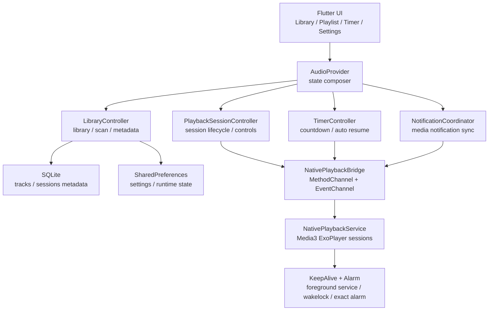

# AudioPlayer

AudioPlayer 是一款面向 Android 本地音频库、ASMR、长音频和多会话播放场景的 Flutter 音频播放器。界面和业务状态由 Flutter 承载，后台播放、通知控制、息屏保活、原生计时闹钟和文件扫描由 Android 原生能力兜底。

当前版本：`1.1.15+10115`

最新发布页：[v1.1.15](https://github.com/NameIess-art/AudioPlayer/releases/tag/v1.1.15)

## 功能亮点

- 多会话播放：可同时创建多个播放会话，每个会话独立控制播放、暂停、切歌、进度、音量、循环策略和左右声道交换。
- 后台与息屏稳定播放：Android 原生播放服务、前台服务、WakeLock、通知保活和原生 Alarm 共同兜底，适合长时间息屏播放。
- 睡眠计时器：支持手动倒计时、播放触发倒计时、到时暂停，以及计时结束后的定时自动恢复播放。
- 曲库管理：支持文件夹/资料库导入、原生扫描、去重、目录树排序、搜索、封面发现和 SQLite 持久化。
- 封面与字幕：封面按区域最大化填充显示，可裁切但不拉伸；支持字幕解析缓存、播放进度字幕刷新和通知字幕。
- 元数据持久化：保存扫描时间、文件大小、mtime、播放进度、收藏、标签、封面缓存、歌词路径和播放会话状态。
- 更新与发布：应用内可检查 GitHub Release，新版本提供 arm64-v8a、armeabi-v7a、x86_64 三个 APK。

## 下载

从 [GitHub Release v1.1.15](https://github.com/NameIess-art/AudioPlayer/releases/tag/v1.1.15) 下载适合设备 CPU 架构的 APK：

| 文件 | 适用设备 |
|---|---|
| `app-arm64-v8a-release.apk` | 大多数 2018 年后的 Android 手机，推荐优先下载 |
| `app-armeabi-v7a-release.apk` | 较老的 32 位 Android 设备 |
| `app-x86_64-release.apk` | x86_64 模拟器或少量 x86 Android 设备 |

如果不确定设备架构，优先尝试 `app-arm64-v8a-release.apk`。安装时 Android 可能提示“未知来源应用”，需要允许浏览器或文件管理器安装 APK。

## 架构概览



## 项目结构

```text
lib/
  i18n/                         多语言文案
  models/                       MusicTrack、LibraryNode、PlaybackMode
  providers/                    AudioProvider 门面、控制器与功能拆分
  screens/                      音频库、播放列表、计时器、设置、视频转音频
  services/                     SQLite、Native 桥接、通知、字幕、队列、更新
  widgets/                      通用组件、播放卡片、异步封面

android/app/src/main/kotlin/    原生播放、通知、扫描、计时闹钟、保活服务
third_party/audio_service/      项目内维护的 audio_service fork
test/                           数据库、队列、通知、计时器、Provider 等测试
```

## 权限说明

| 权限 | 用途 |
|---|---|
| `READ_MEDIA_AUDIO` / `READ_EXTERNAL_STORAGE` | 扫描和播放用户选择的本地音频 |
| `MANAGE_EXTERNAL_STORAGE` | 支持完整本地音频库扫描 |
| `POST_NOTIFICATIONS` | Android 13+ 显示播放通知 |
| `FOREGROUND_SERVICE` / `FOREGROUND_SERVICE_MEDIA_PLAYBACK` | 后台与息屏播放 |
| `WAKE_LOCK` | 降低息屏后 CPU 过早休眠导致播放/计时不稳定的概率 |
| `REQUEST_IGNORE_BATTERY_OPTIMIZATIONS` | 引导用户允许后台运行/忽略电池优化 |
| `SCHEDULE_EXACT_ALARM` | 计时到点暂停和自动恢复播放的原生兜底 |
| `REQUEST_INSTALL_PACKAGES` | 应用内下载新 APK 后触发系统安装流程 |
| `INTERNET` | 检查 GitHub Release 更新 |

## 本地开发

```bash
flutter pub get
flutter analyze
flutter test
flutter run
```

构建三个 ABI 发布包：

```bash
flutter build apk --release --split-per-abi
```

## audio_service fork notes

- The project currently uses `dependency_overrides` to point `audio_service` at `third_party/audio_service`.
- Fork-specific customization notes live in `third_party/audio_service/CUSTOMIZATION.md`.
- Keep that document updated with the upstream tag or commit we forked from, the files changed locally, and the reason each patch still exists.

## 发行说明 v1.1.15

- 优化页面打开与切换加载速度：并行化启动数据加载、延迟构建非当前页、降低 BackdropFilter GPU 开销并压缩重建范围。
- 同步版本、README 和 Release 信息到 `1.1.15+10115`，发布 arm64-v8a、armeabi-v7a、x86_64 三个 APK。
